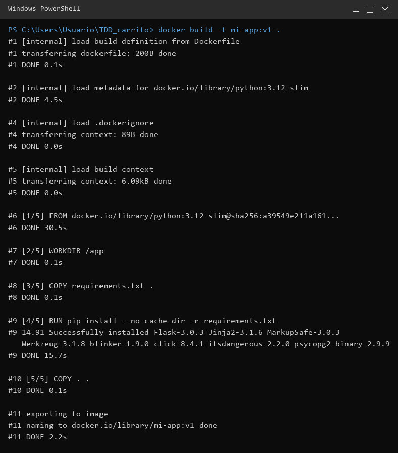
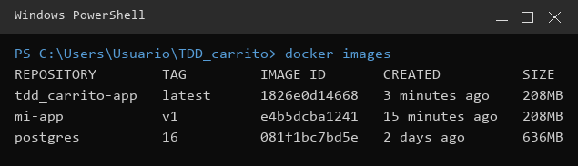
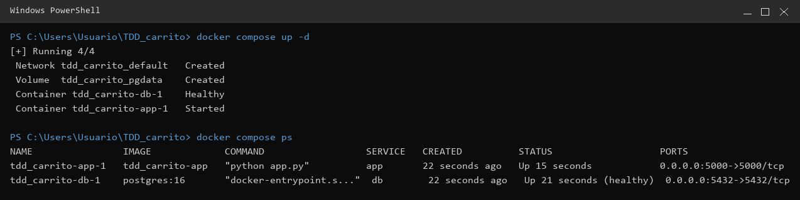
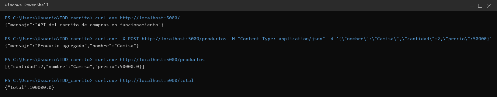
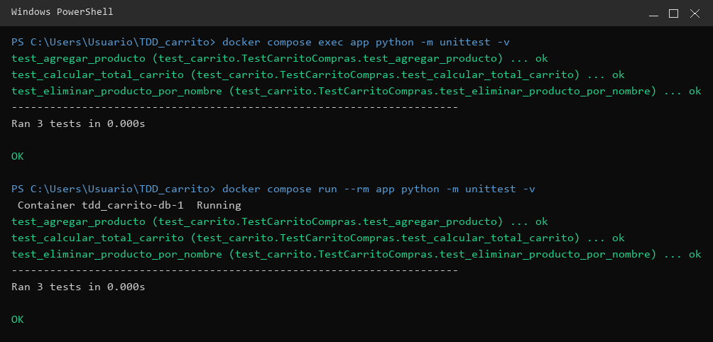
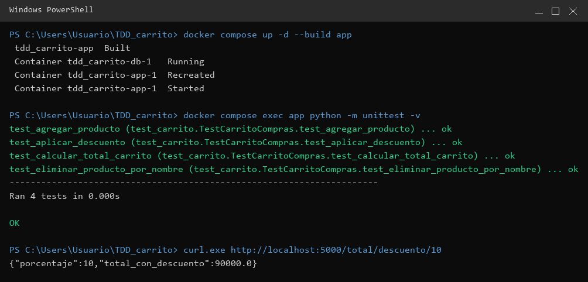
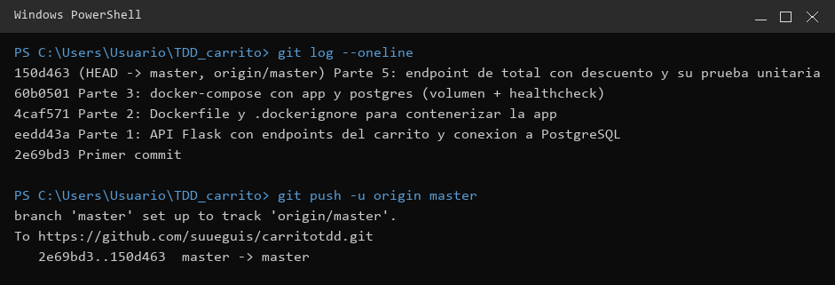

# Taller — Dockerfile, Docker Compose y Pruebas en Contenedores

**Estudiante:** Susana Eguis Muñoz
**Asignatura:** Pruebas
**Fecha de elaboración:** 12 de junio de 2026
**Repositorio:** https://github.com/suueguis/carritotdd

---

## Descripción

API de un **carrito de compras** hecha en **Python + Flask**, conectada a **PostgreSQL**,
contenerizada con **Docker** y orquestada con **Docker Compose**. La lógica del carrito está
aislada en la clase `Carrito`, lo que permite probarla con `unittest`.

| Componente | Tecnología |
|------------|------------|
| Lenguaje / framework | Python 3.12 + Flask 3.0.3 |
| Base de datos | PostgreSQL 16 (driver `psycopg2-binary`) |
| Pruebas | `unittest` |
| Contenedores | Docker + Docker Compose |

```
TDD_carrito/
├── app.py              # API Flask (endpoints)
├── carrito.py          # Lógica de negocio (clase Carrito)
├── test_carrito.py     # Pruebas unitarias
├── requirements.txt
├── Dockerfile
└── docker-compose.yml
```

---

## Parte 1 — La aplicación

**Lógica de negocio — `carrito.py`:**

```python
# carrito.py refactorizado
class Carrito:
    def __init__(self):
        self.productos = []

    def agregar_producto(self, nombre, cantidad, precio):
        self.productos.append({"nombre": nombre, "cantidad": cantidad, "precio": precio})

    def calcular_total(self):
        return sum(prod["precio"] * prod["cantidad"] for prod in self.productos)

    def eliminar_producto(self, nombre_producto):
        self.productos = [p for p in self.productos if p["nombre"] != nombre_producto]

    def aplicar_descuento(self, porcentaje):
        if porcentaje < 0 or porcentaje > 100:
            raise ValueError("El porcentaje debe estar entre 0 y 100")
        total = self.calcular_total()
        return total - (total * porcentaje / 100)
```

**Endpoints expuestos** (en `app.py`, conectados a PostgreSQL por variables de entorno):

| Método | Ruta | Acción |
|--------|------|--------|
| `GET` | `/` | Endpoint principal / estado |
| `POST` | `/productos` | Crear (agregar) un producto |
| `GET` | `/productos` | Listar productos |
| `DELETE` | `/productos/<nombre>` | Eliminar un producto |
| `GET` | `/total` | Calcular el total |
| `GET` | `/total/descuento/<porcentaje>` | Total con descuento *(Parte 5)* |

**Pruebas unitarias — `test_carrito.py`:**

```python
# test_carrito.py
import unittest
from carrito import Carrito

class TestCarritoCompras(unittest.TestCase):

    def test_calcular_total_carrito(self):
        carrito = Carrito()
        carrito.productos = [
            {"nombre": "Camisa", "cantidad": 2, "precio": 50000},   # 100,000
            {"nombre": "Zapatos", "cantidad": 1, "precio": 120000}  # 120,000
        ]
        self.assertEqual(carrito.calcular_total(), 220000)

    def test_eliminar_producto_por_nombre(self):
        carrito = Carrito()
        carrito.productos = [
            {"nombre": "Camisa", "cantidad": 2, "precio": 50000},
            {"nombre": "Zapatos", "cantidad": 1, "precio": 120000}
        ]
        carrito.eliminar_producto("Camisa")
        self.assertEqual(len(carrito.productos), 1)
        self.assertEqual(carrito.productos[0]["nombre"], "Zapatos")

    def test_agregar_producto(self):
        carrito = Carrito()
        carrito.agregar_producto("Gorra", 3, 25000)
        self.assertEqual(len(carrito.productos), 1)
        self.assertEqual(carrito.calcular_total(), 75000)

    # Prueba agregada en la Parte 5
    def test_aplicar_descuento(self):
        carrito = Carrito()
        carrito.agregar_producto("Camisa", 2, 50000)  # 100,000
        self.assertEqual(carrito.aplicar_descuento(10), 90000)  # -10%
```

> El código completo de `app.py` está en el repositorio.

---

## Parte 2 — El Dockerfile

```dockerfile
FROM python:3.12-slim
WORKDIR /app
COPY requirements.txt .
RUN pip install --no-cache-dir -r requirements.txt
COPY . .
EXPOSE 5000
CMD ["python", "app.py"]
```

**`docker build -t mi-app:v1 .`** — construcción sin errores (se ven las capas `[1/5]` … `[5/5]`):



**`docker images`** — la imagen aparece en el listado:



---

## Parte 3 — Docker Compose

```yaml
services:
  db:
    image: postgres:16
    environment:
      POSTGRES_USER: carrito_user
      POSTGRES_PASSWORD: carrito_pass
      POSTGRES_DB: carrito_db
    ports:
      - "5432:5432"
    volumes:
      - pgdata:/var/lib/postgresql/data
    healthcheck:
      test: ["CMD-SHELL", "pg_isready -U carrito_user -d carrito_db"]
      interval: 5s
      timeout: 5s
      retries: 5

  app:
    build: .
    environment:
      DB_HOST: db
      DB_PORT: 5432
      DB_NAME: carrito_db
      DB_USER: carrito_user
      DB_PASSWORD: carrito_pass
    ports:
      - "5000:5000"
    depends_on:
      db:
        condition: service_healthy

volumes:
  pgdata:
```

Cumple: imagen oficial de Postgres con sus variables · **volumen** `pgdata` · **healthcheck** ·
`app` construida desde el `Dockerfile` · conexión por **variables de entorno** ·
`depends_on: service_healthy` · puertos `5000` y `5432` mapeados al host.

**`docker compose up -d` y `docker compose ps`** — ambos servicios corriendo, la BD `healthy`:



**La aplicación responde desde la máquina** (crear → listar → total):



---

## Parte 4 — Pruebas dentro del contenedor

Ejecutadas dentro del contenedor con `exec` (contenedor en ejecución) y con `run --rm`
(contenedor temporal que se elimina al terminar). **Las 3 pruebas pasan:**

```powershell
docker compose exec app python -m unittest -v
docker compose run --rm app python -m unittest -v
```



---

## Parte 5 — Modificación y reconstrucción

Se agregó el endpoint `GET /total/descuento/<porcentaje>` y su prueba `test_aplicar_descuento`:

```python
# Endpoint agregado en la Parte 5: total del carrito aplicando un descuento
@app.route("/total/descuento/<int:porcentaje>", methods=["GET"])
def total_con_descuento(porcentaje):
    carrito = cargar_carrito_desde_bd()
    try:
        total = carrito.aplicar_descuento(porcentaje)
    except ValueError as error:
        return jsonify({"error": str(error)}), 400
    return jsonify({"porcentaje": porcentaje, "total_con_descuento": total})
```

Se reconstruyó **solo** el servicio `app` sin tumbar la base de datos
(`docker compose up -d --build app`). Las **4 pruebas** pasan y el nuevo endpoint responde
(`Camisa` x2 = 100.000 → −10% = **90.000**):



> En la captura de `docker compose ps` de la Parte 3 se observa que la base de datos lleva varios
> minutos arriba mientras la app fue recreada hace segundos: confirma que la BD **no** se reinició.

---

## Historial de Git y GitHub

El proyecto se construyó por fases a lo largo de la tarde/noche del 12 de junio y se subió al
repositorio remoto:



---

## Entregables — checklist

| Entregable | Estado |
|------------|:------:|
| Código fuente de la aplicación (`app.py`, `carrito.py`) | ✅ |
| Pruebas unitarias (`test_carrito.py`) — 4 pruebas | ✅ |
| `Dockerfile` | ✅ |
| `docker-compose.yml` | ✅ |
| Captura de `docker compose ps` con ambos servicios corriendo | ✅ (Parte 3) |
| Captura de las pruebas en el contenedor, todas pasando | ✅ (Partes 4 y 5) |
| Proyecto en GitHub | ✅ (`suueguis/carritotdd`) |
